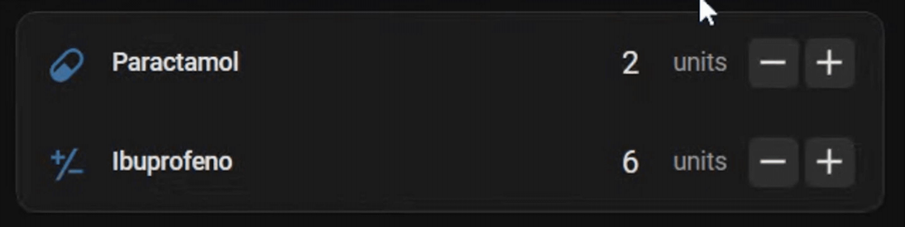
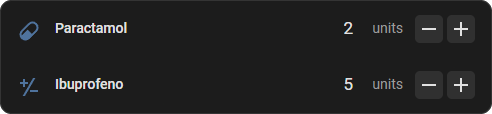

<!--  Colocar na linha 2-->

# Drugstore Stock Card

[🇧🇷 Read in Brazilian Portuguese](README.pt-br.md)

A custom card to display and edit your medicine stock in Home Assistant.

## Overview

Drugstore Stock Card is a frontend card for Home Assistant that integrates with the Drugstore Stock integration, allowing you to easily view, manage and update your medicine inventory from your dashboard.

## Installation

### Method 1: Installation via HACS (Recommended)
1. Go to **`HACS` > `3 dots` > `Custom repositories`**
2. Add: `https://github.com/BigPiloto/ha-drugstore-stock-card`
3. Select the category: **`Dashboard`**
4. Click **`ADD`**
5. Find and click `Drugstore Stock` in the list of integrations
6. Click **`Download`** and install
7. Click **`Reload`**
   
### Method 2: Manual Installation
1. Download the `drugstore-stock-card.js` file
2. Place it in the `/config/www/` folder in your Home Assistant
3. In **`Settings` > `Dashboards` > `3 dots` > `Resources` > `Add Resource`**
4. Add `/local/drugstore-stock-card.js` to the URL.
5. Select **`JavaScript Module`**
6. Click **`Create`**

## Usage

[Usage via Visual Editor](documentation/examples-ui.md)

[Usage via Code Editor](documentation/examples-code.md)

## Screenshots

## Support & Issues

- Report bugs or suggestions at: [Issues](https://github.com/BigPiloto/ha-drugstore-stock-card/issues)

## License

This project is licensed under the MIT License - see the file [MIT License](LICENSE) for details.
