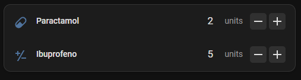

<!--  Colocar na linha 2-->

# Drugstore Stock Card

Card personalizado para exibir e editar o estoque de remédios integrado ao Home Assistant.

## Visão Geral

O Drugstore Stock Card é um card frontend para o Home Assistant que se integra à integração Drugstore Stock, permitindo visualizar, gerenciar e atualizar facilmente seu estoque de medicamentos pelo dashboard.

## Instalação

### Método 1: Instalação via HACS (Recomendado)
1. Vá em **`HACS` > `3 pontos` > `Custom repositories`**
2. Adicione: `https://github.com/BigPiloto/ha-drugstore-stock-card`
3. Selecione a categoria: **`Dashboard`**
4. Clique em **`ADD`**
5. Encontre e clique em `Drugstore Stock` na lista de integrações
6. Clique em **`Download`** e instale
7. Clique em **`Reload`**

### Método 2: Instalação manual
1. Baixe o arquivo `drugstore-stock-card.js`.
2. Coloque-o na pasta `/config/www/` do seu Home Assistant.
3. Em **`Configurações` > `Dashboards` > `3 pontos` > `Recursos` > `Adicionar Recurso`**
4. Adicione `/local/drugstore-stock-card.js` na URL.
5. Selecione **`Módulo JavaScript`**
6. Clique em **`Criar`**

## Uso

[Uso via Editor Visual](documentation/examples-ui.pt-BR.md)
[Uso via Editor de Código](documentation/examples-code.pt-BR.md)

## Prints

## Suporte e Bugs

- Relate problemas ou sugestões em: [Issues](https://github.com/BigPiloto/ha-drugstore-stock-card/issues)

## Licença

Este projeto está licenciado sob a licença do MIT - consulte o arquivo [MIT License](LICENSE) para obter detalhes.
