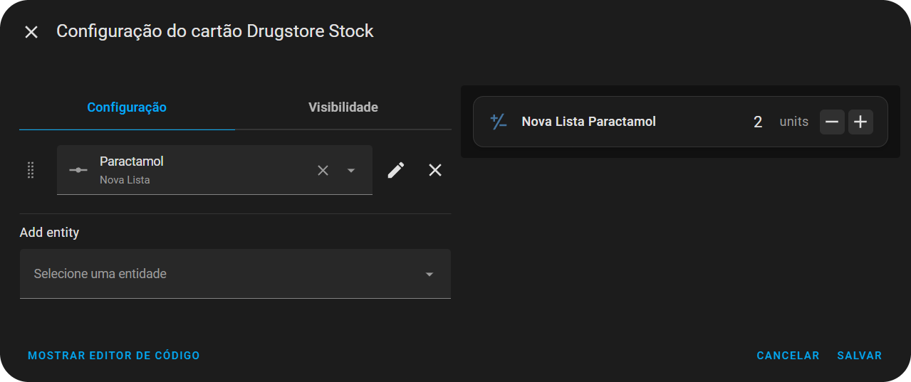
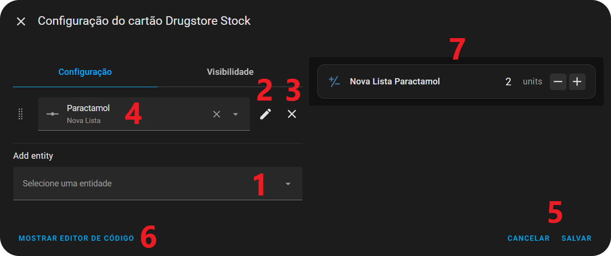
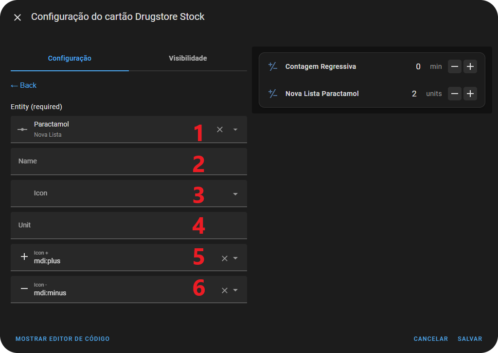

# Adding a New Card 📋

1. Go to **`Edit dashboard` > `+ Add Card`**
2. Search for `Drugstore Stock Card`
3. The visual editor will open with 1 pre-registered example of a `number` entity

 

## Defining Buttons

1. Add a new **`number`** entity
     1. Clicking it opens the list of all **`number`** entities available in your **Home Assistant**
     2. You can type to search and find the desired entity
     3. Clicking on an entity will add it and take you to the edit page for that entity (see example below)
     4. If you try to add an entity that is already in the list, you will be redirected to the edit page for that entity (see example below). It is not possible to have two entities with the same ID in the card at the same time
2. Edit the corresponding entity on the side (redirects to the edit page for that entity, see example below)
3. Delete the corresponding entity on the side
     1. You can also use the **X** inside the entity box
4. Show/Edit the entity in the box
5. Standard HA buttons to save or cancel the card
6. Switch to [Code Editing](examples-code.md)
7. Live preview of your card

 

## Editing an Entity

1. Show/Edit the entity
2. Change the display name (If not set: **`List Name Medicine Name`**)
3. Change the display icon (If not set: **`mdi:plus-minus-variant`**)
4. Change the unit of measurement label (If not set: uses the unit defined for the medicine)
5. Change the icon for increasing/adding 1 to the counter (Default: **`mdi:plus`**)
6. Change the icon for decreasing/subtracting 1 from the counter (Default: **`mdi:minus`**)
  
 

## Changing the Order of Entities

If you want to change the display order of the entities, **`click, hold and drag`** the icon shown in the image
