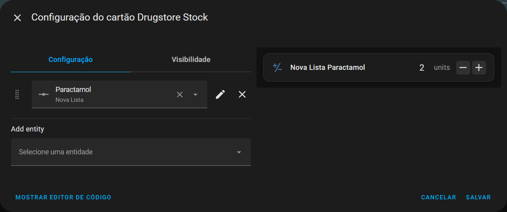
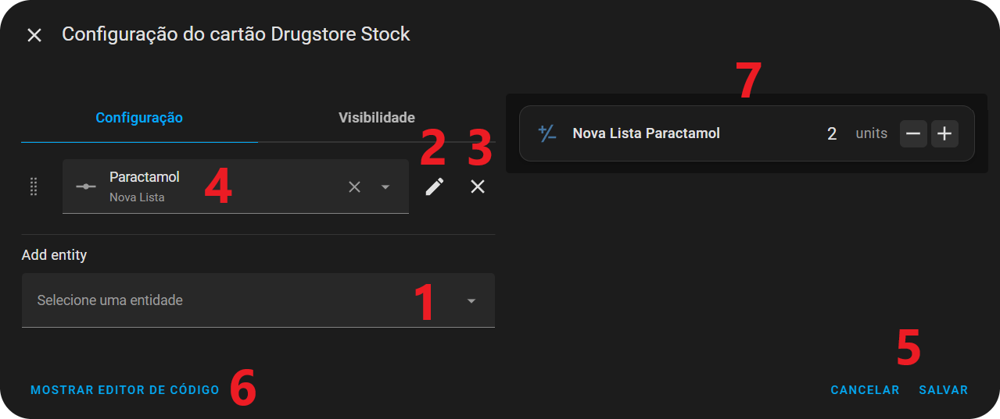
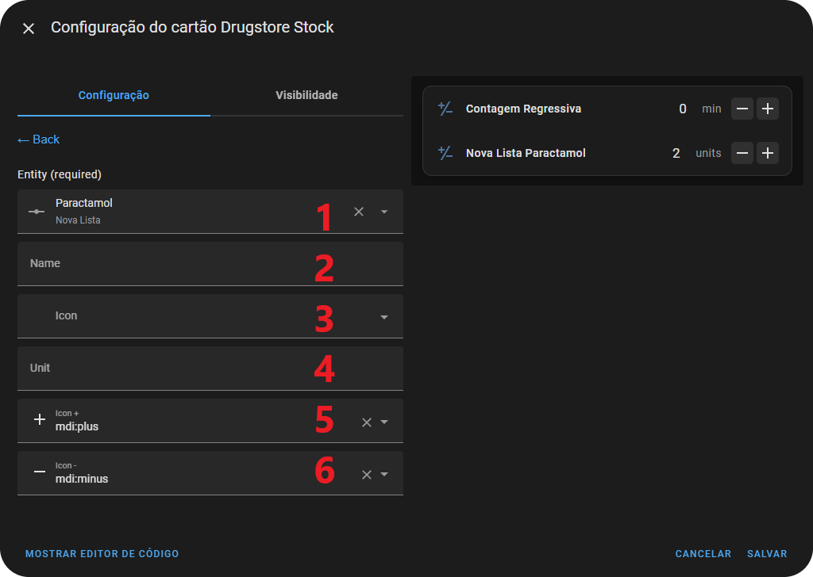
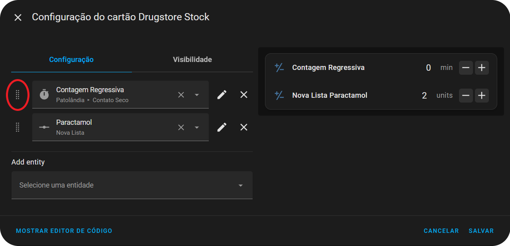

# Adicionando um novo card 📋

1. Vá em **`Editar dashboard` > `+ Adicionar Cartão`**
2. Procure por `Drugstore Stock Card`
3. Irá abrir o editor visual com 1 exemplo pré cadastrado de alguma entidade `número`

 

## Definindo botões

1. Adiciona uma nova entidade do tipo **`número`**
    1. Ao clicar abre a lista de todas as entidades tipo **`número`** que há em seu **Home Assistant**
    2. É possível digitar e encontrar a entidade escolhida
    3. Ao clicar em uma entidade será adicionado e direcionado para a página de edição daquela entidade (exemplo abaixo)
    4. Se tentar adicionar uma entidade que já está na lista, você será direcionado para a página de edição daquela entidade (exemplo abaixo), não sendo possível colocar 2 entidades com mesmo ID no mesmo card ao mesmo tempo
3. Edita a entidade correspondente ao lado (direciona para a págin de edição daquela entidade (exemplo abaixo)
4. Exclui a entidade correspondente ao lado
    1. Também é possível utilizar o **X** dentro do quadro da entidade
6. Exibi/Altera a entidade do quadro
7. Botões padrão do HA para salvar o quadro ou cancelar
8. Altera para [Edição via código](examples-code.pt-BR.md)
9. Pré visualização do seu card

 

## Editando entidade

1. Exibi/Altera a entidade
2. Altera o nome de visualização (Se não definido: **`Nome da Lista` `Nome do medicamento`**)
3. Altera o ícone de exibição (Se não definido: **`mdi:plus-minus-variant`**)
4. Altera o nome da unidade de medida (Se não definido: unidade de medida cadastrada no medicamento)
5. Altera o ícone que aumenta/soma 1 no contador (Padrão: **`mdi:plus`**)
6. Altera o ícone que diminui/subtrai 1 no contador (Padrão: **`mdi:minus`**)

 

## Alterando a ordem das entidades

Caso queira alterar a ordem de visualização das entidades, **`clicar, segurar e arrastar`** o ícone apresentado na imagem
